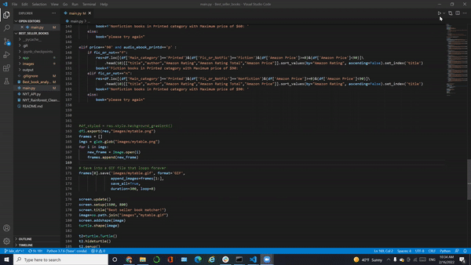
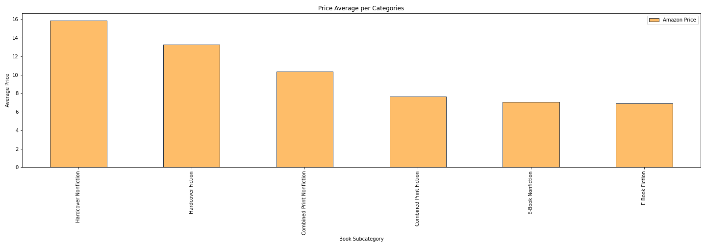
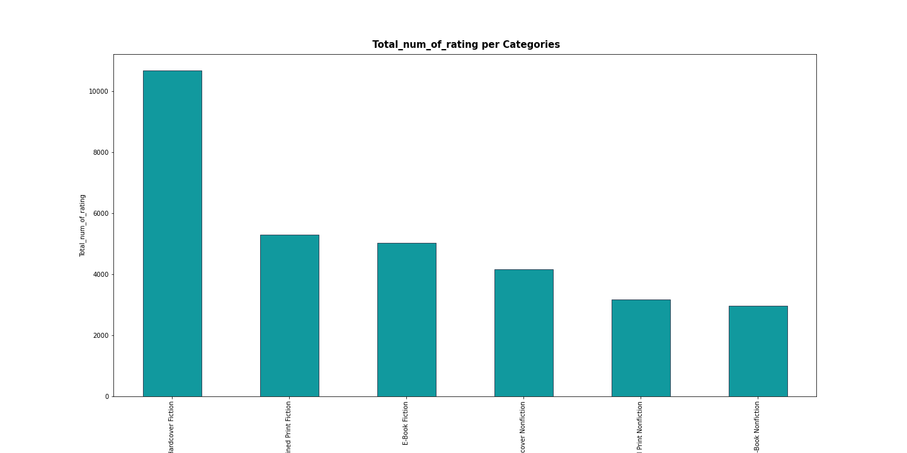
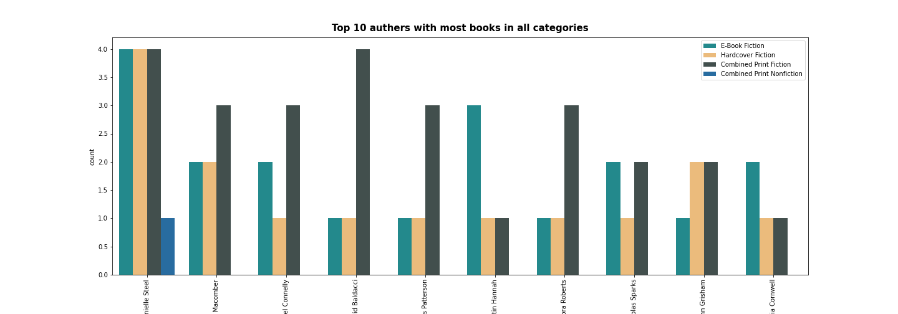
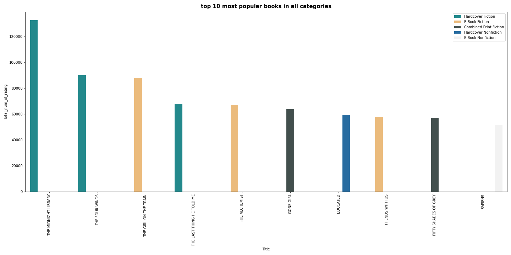
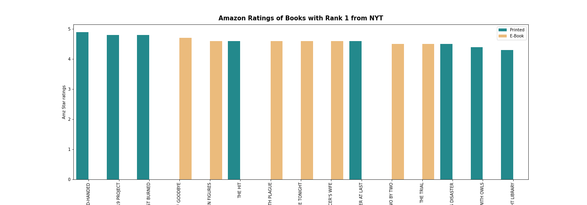
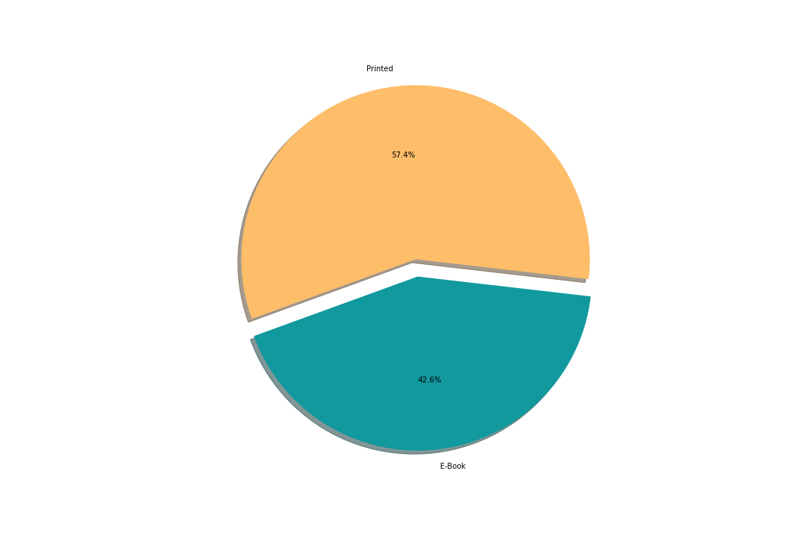
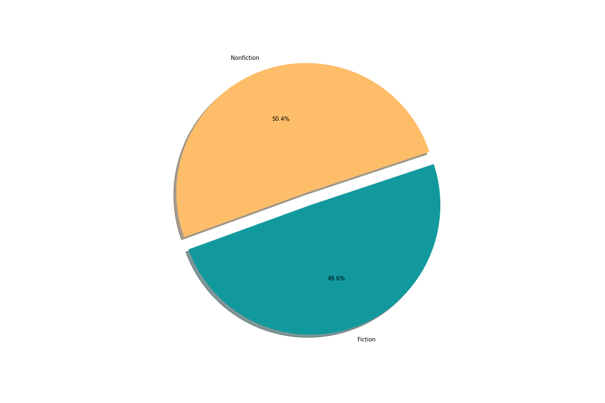
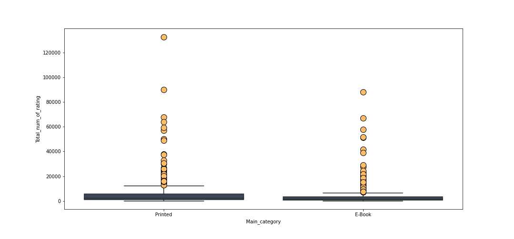

# Project1

## What is the most popular and best selling books on your budget?

## Research Question 1: What are the top ten rated books and their authors?

The top ten books rated books on Amazon (having ratings of 4.9 or 5) are:
-	“The Quiet” by Susan Cain
-	“The Bomber Mafia” by Malcolm Gladwell
-	“Project Hail Mary” by Andy Weir
-	“Rock Paper Scissors” by Alice Feeney
-	“Red-Handed” by Peter Schweizer
-	“American Marxism” by Mark R. Levin
-	“A Dog’s Purpose” by W Bruce Cameron
-	“Sum It Up” by Pat Head Summitt with Sally Jenkins
-	“Immune” by Philipp Dettmer
-	“This Bright Future” by Bob Hall

## Research Question 2: What is the average price for each book category?

The average prices for each book category, from most expensive to least expensive, were: hardcover fiction (M= $15.87), hardcover fiction (M= $13.25), combined print nonfiction (M=$10.38), combined print fiction (M=$7.65), e-book nonfiction (M=$7.09), and e-book fiction (M=$6.89). Hardcover fiction appears to be the most expensive book category. 

 
## Research Question 3: What is the average number of ratings for each book category?
 
 
Hardcover fiction was the category with the highest number of ratings at over 10,000. The remaining categories had the following number of reviews, on average: combined print fiction (M = 5,309.38), e-book fiction (M= 5,040.00), hardcover nonfiction (M=4,173.57), combined print nonfiction (M= 3,180.87), and e-book nonfiction (2,977.57).

 
## Research Question 4: Who are the top 10 authors with the most best selling books in all categories?
 

We determined who were the top ten authors in our sample, and evaluated how many bestselling books they had and in which categories the books were available. The top ten bestselling authors in our sample were:
-	Danielle Steel
-	Debbie Macomber
-	David Baldacci
-	Kristin Hannah
-	Nora Roberts
-	James Patterson
-	John Grisham
-	Nicholas Sparks
-	Patricia Cromwell

These authors had multiple bestselling publications across multiple categories, including e-books and printed books.

 
## Research Question 5: Which books are the top ten most popular overall?

The list below shows the most popular books on Amazon (e.g. having the highest number of reviews).

-	“The Midnight Library” by Matthew Haig
-	“The Four Winds” by Kristin Hannah
-	“The Girl on the Train” by Paula Hawkins
-	“The Last Thing He Told Me” by Laura Dave
-	“The Alchemist” by Paulo Coelho
-	“Gone Girl” by Gillian Flynn
-	“Educated” by Tara Westover
-	“It Ends With Use” by Colleen Hoover
-	“Fifty Shades of Gray” by E L James
-	“Sapiens” by Yuval Norah Harari

## Research Question 6: What are the Amazon ratings for the books ranked #1 on the NYT Bestseller list?

We narrowed our sample down to the books listed as number one on the New York Times’ Bestseller List and looked at their ratings on Amazon. It appears that these books (printed and e-book) were rated quite highly on Amazon (between 4-5 stars).

 
## Research Question 7: Which books were rated most highly: printed or e-books on Amazon? Fiction or nonfiction?

Printed books appeared to have more high rating books (57.4%) compared to e-books (42.6%). 

The ratings appear to be about the same for nonfiction books(50.4%) and fiction books (49.6%).

 
## Research Question 8: Which type of book is more popular on Amazon: printed books or e-books?

We conduct a Shapiro-Wilk’s test to determine if our groups were normally distributed. The results of this test revealed that our samples were not normally distributed (W= 0.42, p < 0.01), thus we violated the normality assumption necessary to the two-samples t-test. 

Therefore, we used the Mann-Whitney U Test, which allows for us to test for the differences between these groups, even though they are not normally distributed. The result of this test revealed that there was a statistically significant difference between printed books and e-books (U= 68,449.00, p < 0.01) such that printed (M = 5,661.46) were more popular on Amazon than e-books books (M= 4,205.49).

